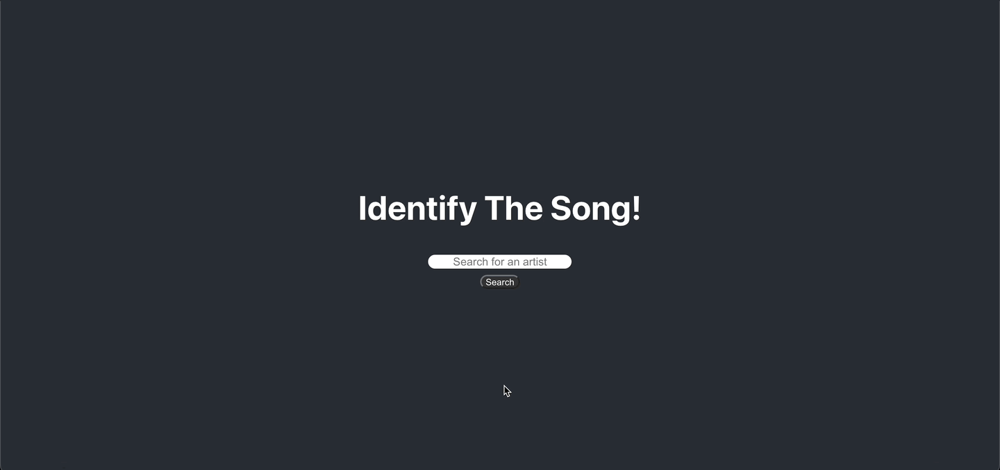

# Song Identification Game
## About
* React web app that uses [Deezer's API](https://developers.deezer.com/api) to retrieve artist and track data. 
* Supports track playback for use in Song ID quiz.

## Usage
1. Ensure that a cross-origin resource sharing (CORS) proxy is being used by the client.
    1. ['Allow CORS' Chrome Extension](https://chrome.google.com/webstore/detail/allow-cors-access-control/lhobafahddgcelffkeicbaginigeejlf?hl=en)
1. Visit [live preview](https://jshalabi03.github.io/song_id_quiz/) deployment.
1. Use search bar to lookup and select a music artist.
1. Listen to five second audio clip from randomly selected track from selected artist's catalogue.
1. Enter the title of the song and submit.
1. View result and repeat.

## [Live Demo](https://jshalabi03.github.io/song_id_quiz/)

